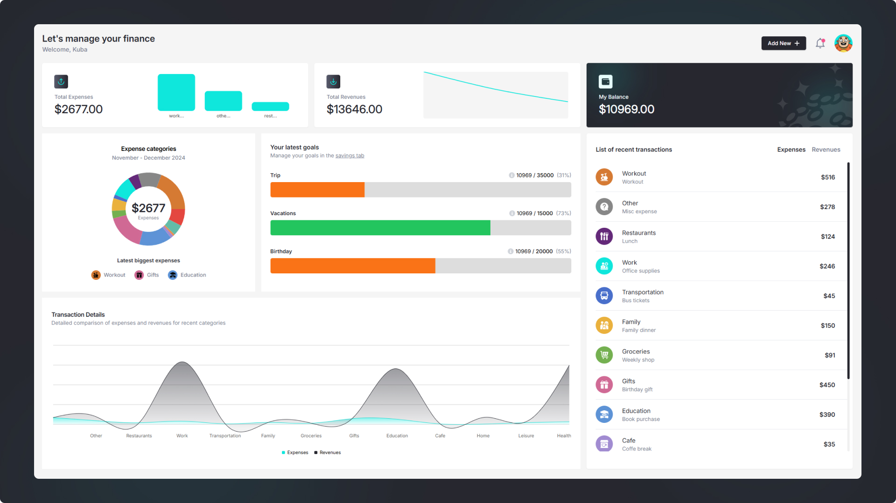
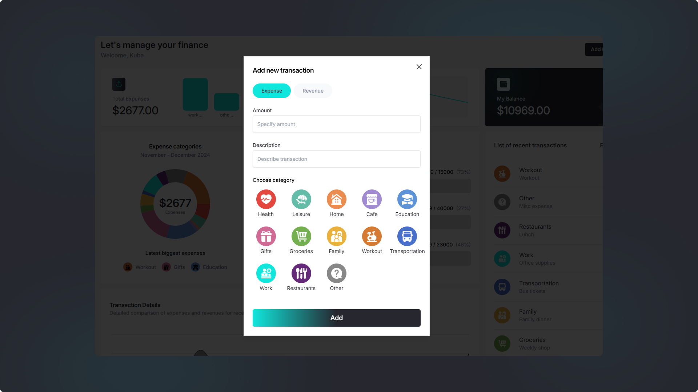
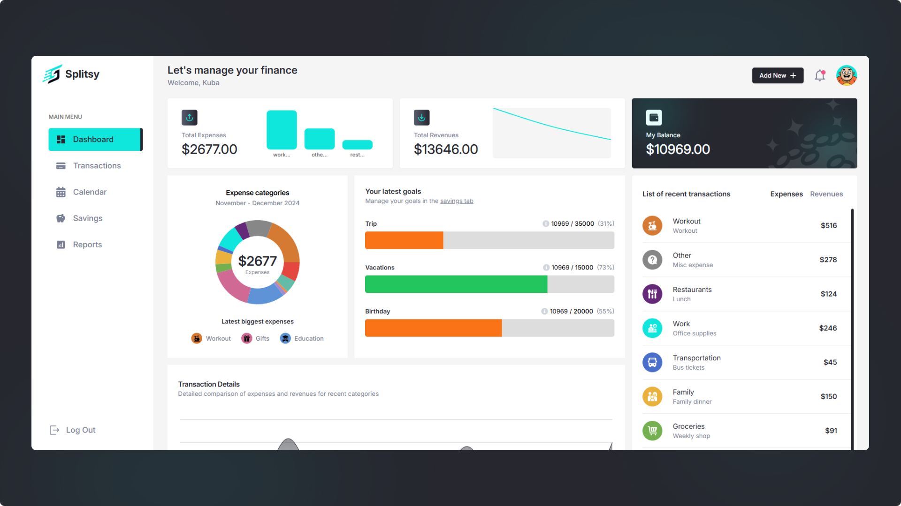
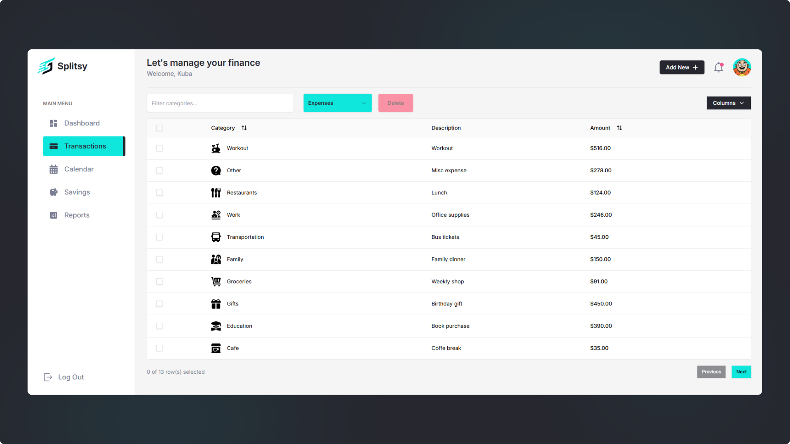
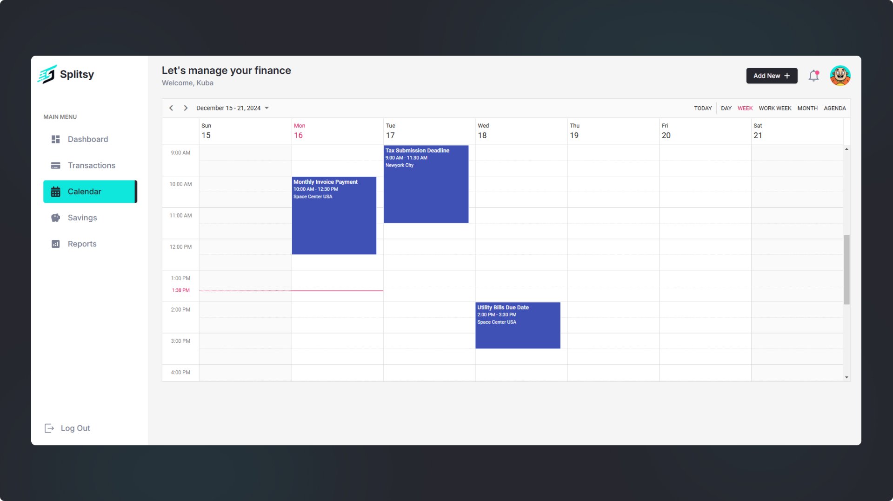
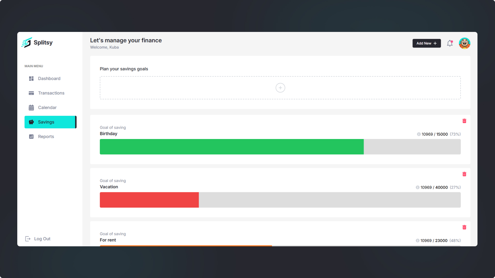
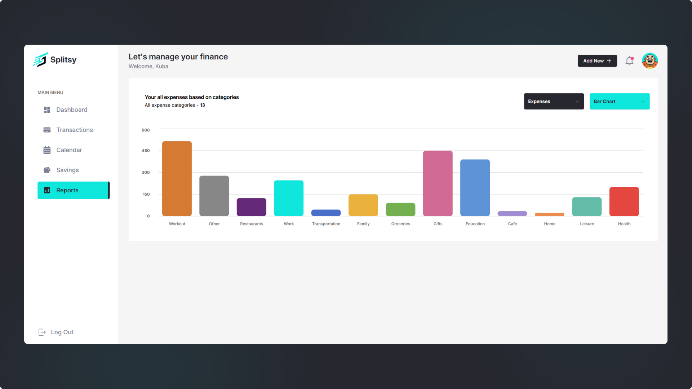
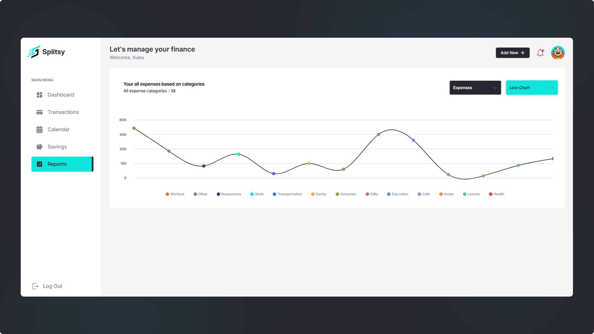

# Splitsy - Application for managing your home budget

In the process of developing

## Introduction

Splitsy is a modern and responsive web application designed to monitor and manage your household budget, allowing you to effectively track expenses, income and savings. Thanks to its intuitive interface and the use of modern technologies, Splitsy allows you to control your finances in a simple and transparent way.

Splitsy application's main functionalities:
<ul>
  <li>Adding transactions -
Allows you to add new expenses and income with detailed description and categorization</li>
  <li>Personalized financial reports - 
Analyze data using line charts, bar charts and pie charts showing spending by category</li>
  <li>Financial Calendar -
Plan important deadlines, such as invoices, fees and other financial obligations, with a preview of upcoming events</li>
  <li>Savings goals -
Create and monitor financial goals (e.g., for vacations, birthdays), with visual tracking of progress</li>
</ul>

Tech Stack:

<ul>
  <li>React.js</li>
  <li>Typescript</li>
  <li>TenStack (React) Query</li>
  <li>Firebase</li>
  <li>TailwindCSS</li>
  <li>ShadCN</li>
  <li>ZOD</li>
  <li>React Hook Form</li>
  <li>Syncfusion</li>
</ul>

 

## Mockup

 

